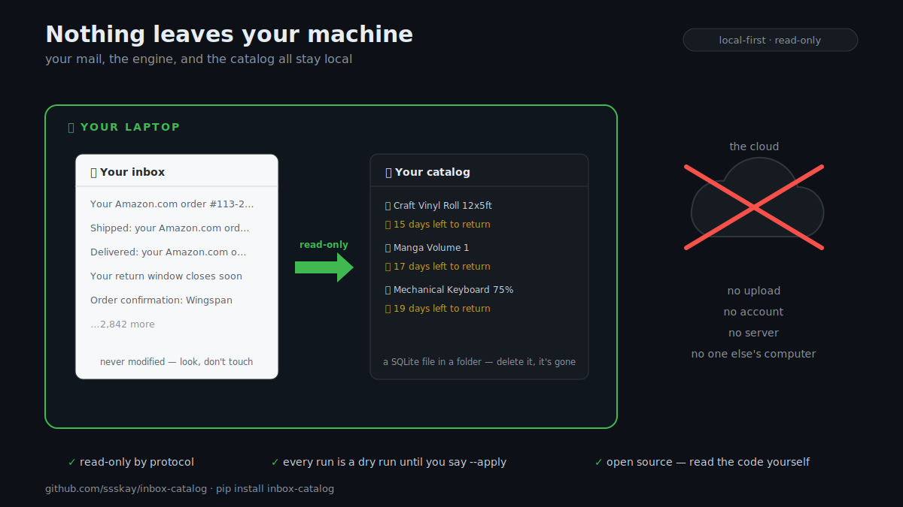

# Getting started

Inbox Catalog reads your order/shipment emails and turns them into a searchable
catalog of what you own — and, for Amazon, a returns tracker with a return-window
clock. This page takes you from zero to your first real run. It's **read-only**:
it can't send, delete, move, or flag mail, and nothing is written until you say so.

There are two ways to use it:

- **Through Claude** — just talk to it ("catalog my orders", "what can I still
  return?"). Claude runs everything for you. Start here.
- **In the terminal** — run the `python3 -m inboxcatalog …` commands yourself.
  Every step below shows the command so you can do either.

---

## 1. Install (30 seconds)

**In Claude Code** — two commands (run them on separate lines):

```
/plugin marketplace add ssskay/inbox-catalog
/plugin install inbox-catalog@inbox-catalog
```

**Or pip install it** (just the engine, runs from any directory):

```bash
pip install inbox-catalog
```

**Or clone it** (works with or without the plugin system):

```bash
git clone https://github.com/ssskay/inbox-catalog ~/Code/inbox-catalog
cd ~/Code/inbox-catalog
```

The plugin and clone paths need no `pip install` to try the demo — the offline
path runs on the Python standard library alone.

---

## 2. Try the demo (no mail, no credentials)

Ask Claude: **"catalog the demo purchases"** or **"demo the Amazon returns tracker."**

Or run it yourself (the `INBOX_DATA_DIR` keeps the demo in a throwaway catalog so
it never touches your real data):

```bash
export INBOX_DATA_DIR="$(mktemp -d)"
python3 -m inboxcatalog --profile amazon --ingest --fixtures --apply
python3 -m inboxcatalog --profile amazon --returns
```

You'll get a returns report from synthetic `@example.com` mail — items still in
their window (most urgent first), an expired one, a spend flag, and a life-zone
triage. That's the whole feature set, proven offline.

---

## 3. See where you stand

```bash
python3 -m inboxcatalog doctor
```

A one-screen check: what's installed, what's in your catalog, and which read-only
mail paths are configured — ending in your single next step. It never reads a
secret or a mailbox. Run it any time you're unsure what's set up.

---

## 4. Connect your real Amazon mail



The full returns tracker needs the engine to read your real mail. The recommended
way is a **Gmail app password** (read-only, revocable). Full detail with
screenshots-level steps is in [`docs/connect-gmail.md`](docs/connect-gmail.md);
the short version:

1. **Turn on 2-Step Verification** on your Google account (required for app
   passwords).
2. **Create an app password** (Google account → Security → App passwords). You get
   a 16-character code.
3. **Store it** so the engine can find it — either:

   ```bash
   # macOS Keychain (persistent, recommended):
   security add-generic-password -a "$USER" -s inbox-catalog-imap -w 'your-app-password'
   # …or just for this shell:
   export INBOX_IMAP_PASSWORD='your-app-password'
   ```

4. **Install the real-mail deps once** (image downloads need `requests`; skip
   this if you `pip install`ed — those deps came with it):

   ```bash
   pip3 install --break-system-packages -r requirements.txt
   ```

5. **Dry run first, then apply** (point `INBOX_IMAP_ACCOUNT` at your Gmail
   address — a Google Workspace/custom-domain address works too):

   ```bash
   INBOX_IMAP_ACCOUNT='you@gmail.com' python3 -m inboxcatalog --profile amazon --ingest --imap            # DRY RUN — shows what it WOULD do
   INBOX_IMAP_ACCOUNT='you@gmail.com' python3 -m inboxcatalog --profile amazon --ingest --imap --apply     # once it looks right
   python3 -m inboxcatalog --profile amazon --returns
   ```

Prefer no credential at all? Export your mail from
[Google Takeout](https://takeout.google.com) as `.mbox` and use
`--mbox path/to/export.mbox` instead of `--imap`.

> **Note:** a Gmail *connector* in Claude can give a general catalog, but the
> return-window clock and triage come from this engine reading your mail via
> `--imap`/`--mbox`. So for the returns tracker, use the app-password path above.

---

## 5. Everyday use

```bash
python3 -m inboxcatalog --profile amazon --returns                     # what's still returnable, most urgent first
python3 -m inboxcatalog --profile amazon --triage                      # grouped by life zone + spend flags
python3 -m inboxcatalog --profile amazon --mark "Yoga Mat" keep        # record a decision
python3 -m inboxcatalog --profile amazon --returns --months 3          # scope to a window
```

Re-running ingest is always safe: later shipment/delivery/return-window emails
**enrich** existing items, and **refund emails auto-mark that order `returned`** —
so a periodic re-ingest keeps everything current with no manual bookkeeping.

---

## 6. Make it yours (optional)

- **Custom life zones.** The triage zones are generic by default. Drop your own
  taxonomy in `inboxcatalog/profiles/zones.local.json` (gitignored — it's your
  data) to route into your own categories. Format + walkthrough:
  [`references/life-zone-routing.md`](references/life-zone-routing.md).
- **Recognize your own shops** (beyond Amazon). Write a profile — sender
  allowlist + keywords + optional templates. See
  [`references/writing-a-profile.md`](references/writing-a-profile.md).

---

## Troubleshooting

| Symptom | Fix |
|---|---|
| `No module named inboxcatalog` | Either `pip install inbox-catalog` (then it works from anywhere), or `cd` into the repo (or `$CLAUDE_PLUGIN_ROOT`) and retry. |
| Real inbox catalogs ~0 items | The default profile only knows Amazon/board-game shops. That's expected — use `--profile amazon`, or write a profile for your shops. |
| `--reindex`/`lookup` errors on numpy | Photo search is optional: `pip3 install --break-system-packages 'inbox-catalog[embed]'`. |
| Not sure what's configured | `python3 -m inboxcatalog doctor`. |

Everything read-only, every ingest a dry run until `--apply`. Have fun.
